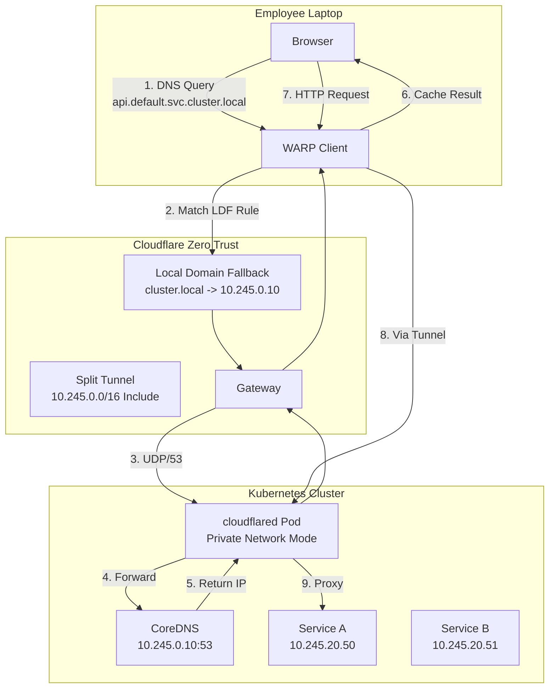

# ZTNA: The Free VPN Killer for Private Kubernetes Access

### How I replaced traditional VPN architecture with Cloudflare Zero Trust Network Access—and built enterprise-grade private connectivity for a friend's trading operation.

---

My friend was building something ambitious: a quantitative trading operation. The algorithms were sharp, the strategy was sound, but there was a problem I'd seen a hundred times before.

"I need my team to access our internal dashboards securely," he said. "But I don't want to deal with VPN hell."

I knew exactly what he meant. I'd watched multi-billion dollar corporations drown in VPN tickets. Three days to onboard a new analyst. Constant disconnects. "Works on my machine" becoming a daily mantra. IT teams buried in firewall rules and spreadsheets that were already obsolete.

My friend didn't have an IT team. He had a vision, a small crew of talented people, and a budget that didn't include enterprise VPN licensing.

"Give me a weekend," I said. "I'll build you something better than what Goldman Sachs uses."

---

## The Quest for MagicDNS (Without the Magic Price Tag)

I started where any engineer starts: researching existing solutions.

**Tailscale** has this beautiful feature called MagicDNS—you connect to their network, and suddenly you can reach `myserver.tailnet` without thinking about IP addresses. It's elegant. But I wanted something that worked with infrastructure we controlled, not another SaaS dependency.

**Border0** caught my eye next. Slick product, good UX. But their free tier was limited, and crucially, they didn't have the MagicDNS-like private DNS resolution I needed. When you're building a trading operation, you want `dashboard.trading.svc.cluster.local` to just *work*—no manual IP mappings.

Then I looked at **Cloudflare Zero Trust**. Free tier: 50 users. That's more than my friend would ever need. And they had all the pieces: WARP client for split tunneling, cloudflared for tunneling into private networks, and—this was the key—**Local Domain Fallback** for private DNS resolution.

The total infrastructure cost? **$12/month** for a basic DigitalOcean Kubernetes cluster (DOKS). Cloudflare's Zero Trust features were free.

Let that sink in. Twelve dollars a month for enterprise-grade private network access.

---

## The Dream: Access Like Magic

Here's what I wanted to build: team members install the WARP client on their laptops, and suddenly they can reach `dashboard.default.svc.cluster.local` or `api.internal`—no VPN configuration, no IT tickets, no waiting.

The WARP client is the secret sauce here. It's not a traditional VPN that routes *all* your traffic through a single chokepoint. It's a **split tunnel**—your Netflix keeps going directly to the internet, but traffic destined for `10.245.0.0/16` (our cluster's internal network) gets routed through Cloudflare to our private infrastructure.

The idea was straightforward:

1. Run a `cloudflared` tunnel inside our Kubernetes cluster
2. Route our cluster's internal CIDR through that tunnel
3. Configure WARP's Local Domain Fallback to send `.cluster.local` DNS queries to our CoreDNS
4. Watch the team access internal services like they were public websites

What could go wrong?

---

## The Architecture (A Love Letter to Network Diagrams)

Before diving into implementation, here's what we're building:



The magic happens in those numbered steps. When an employee types `api.default.svc.cluster.local` in their browser:

1. WARP intercepts the DNS query
2. It matches our Local Domain Fallback rule (`.cluster.local` domains go to our CoreDNS)
3. The query travels through Cloudflare's edge to our tunnel
4. `cloudflared` forwards it to CoreDNS inside the cluster
5. CoreDNS returns the internal IP (say, `10.245.20.50`)
6. The browser now makes an HTTP request to that IP
7. WARP sees the IP is in our split tunnel include list (`10.245.0.0/16`)
8. Traffic flows through the tunnel, hits the service, and the employee sees their dashboard

No clunky VPN client asking for admin permissions. No IT ticket. Just the WARP client quietly doing its job—public traffic goes direct, private traffic goes through the tunnel.

---

## The Implementation: Terraform All The Things

I wasn't going to click through Cloudflare's dashboard. Every setting had to live in code, reviewable and reproducible.

> **Full Terraform implementation:** [github.com/yourusername/cloudflare-ztna-k8s/terraform](https://github.com/yourusername/cloudflare-ztna-k8s/tree/main/terraform)

Here's the structure:

```
terraform/
├── providers.tf          # Cloudflare, Kubernetes, Helm providers
├── variables.tf          # Input variables (secrets, CIDRs, etc.)
├── locals.tf             # Computed values
├── cloudflare.tf         # Tunnel, routes, WARP configuration
├── helm.tf               # cloudflared deployment
└── outputs.tf            # Useful commands for verification
```

### The Critical Pieces

**Creating the tunnel and routing traffic:**

```hcl
resource "cloudflare_tunnel" "k8s" {
  account_id = var.cloudflare_account_id
  name       = "k8s-private-access"
  secret     = base64decode(var.tunnel_secret_base64)
}

resource "cloudflare_tunnel_route" "k8s_private_network" {
  account_id = var.cloudflare_account_id
  tunnel_id  = cloudflare_tunnel.k8s.id
  network    = var.service_cidr  # e.g., "10.245.0.0/16"
  comment    = "Route K8s Service CIDR through tunnel"
}
```

This tells Cloudflare: "When a WARP client tries to reach anything in `10.245.0.0/16`, send it through this tunnel."

**The `protocol = "quic"` trap:**

```hcl
tunnelConfig = {
  protocol = "quic"  # CRITICAL: Must be QUIC for UDP DNS
  warpRouting = {
    enabled = true
  }
}
```

I spent two hours debugging why DNS queries weren't working. The default protocol is HTTP/2, which doesn't support UDP. DNS is UDP. You need QUIC.

Save yourself the debugging. Use QUIC.

### Dashboard Configuration (The Part Terraform Can't Touch)

Some settings still live in Cloudflare's dashboard. In **Cloudflare One > Settings > WARP Client > Device Settings**:

**Split Tunnels (Include Mode):**
- Add: `10.245.0.0/16` (your Service CIDR)

**Local Domain Fallback:**
- Domain: `cluster.local`
- DNS Server: `10.245.0.10` (your CoreDNS ClusterIP)

These tell WARP: "Don't send `.cluster.local` queries to public DNS. Send them through the tunnel to our private DNS server."

---

## The Moment of Truth

After `terraform apply` finished and the cloudflared pods came up healthy, I held my breath and ran:

```bash
nslookup kubernetes.default.svc.cluster.local
```

```
Server:   10.245.0.10
Address:  10.245.0.10#53

Name: kubernetes.default.svc.cluster.local
Address: 10.245.0.1
```

It worked. From my laptop. Through Cloudflare. Into the cluster. No VPN.

I opened the trading dashboard in my browser: `http://dashboard.default.svc.cluster.local:8080`

The page loaded. Charts rendered. Data streamed.

I may have done a small victory dance. My cat was unimpressed.

---

## The Rollout

My friend's first hire was a quant analyst. I sent her two things:

1. A link to download WARP: `https://one.one.one.one`
2. A one-liner: "Install this, click connect, then open `http://dashboard.default.svc.cluster.local:8080`"

Five minutes later:

"Wait, that's it? I can see the trading dashboard. From my apartment. Did I need to configure anything?"

"Nope."

"But... how does my laptop know where `cluster.local` is?"

I smiled. That's the whole point. The WARP client handles the split tunneling—public traffic goes straight to the internet (her Spotify, YouTube, everything normal), while traffic for our private domains routes through Cloudflare into our cluster.

She didn't need to understand the architecture. She just needed it to work. And it did.

---

## What I Learned

### 1. Enterprise Infrastructure is a Mindset, Not a Price Tag

Fortune 500 companies pay millions for VPN infrastructure that's *worse* than what we built for $12/month. The difference isn't money—it's architecture.

Zero Trust Network Access (ZTNA) inverts the VPN model: instead of "anyone inside the network is trusted," every request is authenticated. It's more secure *and* more user-friendly. And Cloudflare gives it away for free.

### 2. Split Tunneling is the Secret Weapon

Traditional VPNs route *all* traffic through corporate infrastructure. Your users' Netflix gets slow. Their video calls drop. They complain.

WARP's split tunneling means only private traffic (`10.245.0.0/16` in our case) goes through the tunnel. Everything else—YouTube, Spotify, their kid's homework site—goes direct. No performance complaints. No bandwidth costs.

### 3. The Protocol Matters

`quic` vs `http2` cost me two hours. UDP doesn't work over HTTP/2 tunnels. DNS uses UDP. If your private DNS resolution isn't working, check the protocol.

### 4. Infrastructure as Code Saves Futures

Every setting lives in Git. When my friend adds a second cluster, it's a copy-paste and a variable change. When someone asks "why does this work?", I point them to the Terraform.

---

## The Bottom Line

Here's what my friend got for **$12/month**:

| What | Cost |
|------|------|
| DigitalOcean Kubernetes (DOKS) | $12/month |
| Cloudflare Zero Trust (50 users) | Free |
| WARP client | Free |
| Cloudflare Tunnel | Free |
| **Total** | **$12/month** |

And here's what that bought:

- **Onboarding time:** 5 minutes (install WARP, click connect)
- **VPN tickets:** Zero
- **Private DNS resolution:** Works like magic
- **Split tunneling:** Public traffic stays fast
- **Security:** Zero Trust model (no "inside the network = trusted")

Multi-billion dollar corporations pay orders of magnitude more for infrastructure that works *worse* than this. They have VPN concentrators, firewall rules, ACLs, NAT tables, and dedicated teams to manage it all.

My friend has a $12 Kubernetes cluster and a Cloudflare account.

The best infrastructure isn't expensive. It's thoughtful.

---

**TL;DR:** For $12/month (a basic DOKS cluster), you can build private network access that rivals what Fortune 500 companies pay millions for. Cloudflare Zero Trust is free for up to 50 users. The WARP client handles split tunneling so only private traffic goes through the tunnel. Your team installs one app and suddenly internal services just *work*.

The full Terraform implementation is available at [github.com/yourusername/cloudflare-ztna-k8s](https://github.com/yourusername/cloudflare-ztna-k8s).

```
# Quick verification after deployment
kubectl get pods -n cloudflare-tunnel -l app.kubernetes.io/name=cloudflared
nslookup kubernetes.default.svc.cluster.local
```

---

## References

- [Cloudflare Tunnel Documentation](https://developers.cloudflare.com/cloudflare-one/connections/connect-apps/)
- [Cloudflare Terraform Provider](https://registry.terraform.io/providers/cloudflare/cloudflare/latest/docs)
- [WARP Client Configuration](https://developers.cloudflare.com/warp-client/)
