# The Post‑VPN Stack: Cloudflare Zero Trust for Private Kubernetes Access

## Introduction

Your quants team needs to access internal Kubernetes services securely without exposing them to the public internet. You’ve already invested in **Cloudflare Zero Trust** (Zero Trust Tunnels), your employees have **WARP clients** installed, and your infrastructure is **Infrastructure-as-Code** in Terraform.

This guide shows you how to combine:
- **Cloudflare Tunnel** (for outbound connectivity)
- **Helm Provider in Terraform** (to deploy `cloudflared`)
- **Cloudflare Zero Trust (DNS & split tunnels)** (for private DNS resolution)
- **Kubernetes Networking** (to route traffic to private services)

The result: a **MagicDNS-like experience** where employees simply connect WARP and immediately access private services via domain names like `dashboard.default.svc.cluster.local` or `api.internal`—no VPN setup, no manual routing, no friction.

---

## Architecture Overview

```mermaid
graph TB
    subgraph Laptop["👤 Employee Laptop"]
        Browser["Browser"]
        WARP["WARP Client"]
    end

    subgraph CF["☁️ Cloudflare Zero Trust"]
        direction TB
        CF_LDF["Local Domain Fallback<br/>cluster.local → 10.245.0.10"]
        CF_ST["Split Tunnel<br/>10.245.0.0/16 Include"]
        CF_GW["Gateway"]
    end

    subgraph K8S["⎈ Kubernetes Cluster"]
        direction TB
        CF_POD["cloudflared Pod<br/>Private Network Mode"]
        COREDNS["CoreDNS<br/>10.245.0.10:53"]
        APP1["Service A<br/>10.245.20.50"]
        APP2["Service B<br/>10.245.20.51"]
    end

    Browser -->|"1. DNS Query<br/>api.default.svc.cluster.local"| WARP
    WARP -->|"2. Match LDF Rule"| CF_LDF
    CF_LDF --> CF_GW
    CF_GW -->|"3. UDP/53"| CF_POD
    CF_POD -->|"4. Forward"| COREDNS
    COREDNS -->|"5. Return IP"| CF_POD
    CF_POD --> CF_GW
    CF_GW --> WARP
    WARP -->|"6. Cache Result"| Browser

    Browser -->|"7. HTTP Request"| WARP
    WARP -->|"8. Via Tunnel"| CF_POD
    CF_POD -->|"9. Proxy"| APP1

    classDef user fill:#e3f2fd,stroke:#1976d2,stroke-width:2px
    classDef cf fill:#fff3e0,stroke:#f57c00,stroke-width:2px
    classDef k8s fill:#e8f5e9,stroke:#388e3c,stroke-width:2px

    class Browser,WARP user
    class CF_LDF,CF_ST,CF_GW,CF_POD cf
    class COREDNS,APP1,APP2 k8s
```



---

## Step 1: Prerequisites & Preparation

### 1.1 Cloudflare Account Setup

Before writing any Terraform, you need:

1. **Create a Tunnel via UI (one-time)**
    
    ```bash
    # Install cloudflared CLIbrew install cloudflare/cloudflare/cloudflared
    # Authenticatecloudflared tunnel login
    # Create tunnelcloudflared tunnel create my-k8s-tunnel
    # List tunnels to get Tunnel IDcloudflared tunnel list
    ```
    
    This generates:
    
    - `~/.cloudflared/cert.pem` (certificate)
    - `~/.cloudflared/<tunnel-id>.json` (credentials)
2. **Create Cloudflare API Token**
    - Go to **Cloudflare Dashboard → My Profile → API Tokens**
    - Create token with permissions:
        - `Account > Cloudflare Tunnel > Edit`
        - `Account > Access: Apps and Policies > Edit`
        - `Zone > DNS > Edit`

### 1.2 Base64 Encode Tunnel Secrets

Convert tunnel credentials to base64 for Terraform/Kubernetes:

```bash
# Encode the credentials JSONbase64 -i ~/.cloudflared/<tunnel-id>.json
# Encode the certificatebase64 -i ~/.cloudflared/cert.pem
# Save these values for laterexport CF_TUNNEL_ID="<tunnel-uuid>"export CF_TUNNEL_SECRET_BASE64="<base64-encoded-json>"export CF_TUNNEL_CERT_BASE64="<base64-encoded-pem>"
```

### 1.3 Gather Kubernetes Cluster Information

```bash
# Get CoreDNS ClusterIPkubectl get svc -n kube-system -o jsonpath='{.items[?(@.metadata.name=="kube-dns")].spec.clusterIP}'# Example output: 10.245.0.10 (DigitalOcean) or 172.20.0.10 (AWS)# Get Service CIDR (check cluster settings or run)kubectl get svc --all-namespaces -o jsonpath='{.items[*].spec.clusterIP}' | tr ' ' '\n' | head -5# Identify the network range, e.g., 10.245.0.0/16
```

---

## Step 2: Terraform Configuration

Your Terraform codebase should organize files like this:

```
terraform/
├── providers.tf          # Provider config
├── variables.tf          # Input variables
├── locals.tf             # Local values
├── cloudflare.tf         # Cloudflare resources (tunnel, routes, policies)
├── helm.tf               # Helm provider & cloudflared chart
├── terraform.tfvars      # Variable values
└── outputs.tf            # Output values
```

### 2.1 `providers.tf` — Define Terraform Providers

```hcl
terraform {
  required_version = ">= 1.0"

  required_providers {
    cloudflare = {
      source  = "cloudflare/cloudflare"
      version = "~> 4.0"
    }
    kubernetes = {
      source  = "hashicorp/kubernetes"
      version = "~> 2.25"
    }
    helm = {
      source  = "hashicorp/helm"
      version = "~> 2.11"
    }
  }
}

# Cloudflare Provider
provider "cloudflare" {
  api_token = var.cloudflare_api_token
}

# Kubernetes Provider (configured via kubeconfig)
provider "kubernetes" {
  config_path = var.kubeconfig_path
}

# Helm Provider (uses Kubernetes provider)
provider "helm" {
  kubernetes {
    config_path = var.kubeconfig_path
  }
}
```

### 2.2 `variables.tf` — Input Variables

```hcl
variable "cloudflare_api_token" {
  description = "Cloudflare API token with Tunnel and DNS permissions"
  type        = string
  sensitive   = true
}

variable "cloudflare_account_id" {
  description = "Cloudflare Account ID (found in Workers dashboard)"
  type        = string
}

variable "kubeconfig_path" {
  description = "Path to kubeconfig file"
  type        = string
  default     = "~/.kube/config"
}

variable "kubernetes_namespace" {
  description = "Kubernetes namespace for cloudflared"
  type        = string
  default     = "cloudflare-tunnel"
}

variable "tunnel_id" {
  description = "Cloudflare Tunnel ID"
  type        = string
}

variable "tunnel_secret_base64" {
  description = "Base64-encoded tunnel credentials JSON"
  type        = string
  sensitive   = true
}

variable "tunnel_cert_base64" {
  description = "Base64-encoded tunnel certificate (cert.pem)"
  type        = string
  sensitive   = true
}

variable "service_cidr" {
  description = "Kubernetes Service CIDR (e.g., 10.245.0.0/16)"
  type        = string
}

variable "coredns_ip" {
  description = "ClusterIP of CoreDNS/kube-dns service (e.g., 10.245.0.10)"
  type        = string
}

variable "private_domain_suffix" {
  description = "Private domain suffix (e.g., 'cluster.local', 'internal.corp')"
  type        = string
  default     = "cluster.local"
}
```

### 2.3 `locals.tf` — Local Values

```hcl
locals {
  tunnel_name = "k8s-${var.cloudflare_account_id}"
  namespace   = var.kubernetes_namespace

  # CommonLabels for all resources
  common_labels = {
    managed-by = "terraform"
    component  = "cloudflare-tunnel"
    environment = "production"
  }
}
```

### 2.4 `terraform.tfvars` — Variable Values

```hcl
cloudflare_api_token    = "your-api-token"
cloudflare_account_id   = "abc123def456"
tunnel_id               = "12345678-1234-1234-1234-123456789012"
tunnel_secret_base64    = "base64-encoded-credentials-json-here"
tunnel_cert_base64      = "base64-encoded-cert-pem-here"
service_cidr            = "10.245.0.0/16"  # DigitalOcean
coredns_ip              = "10.245.0.10"
private_domain_suffix   = "cluster.local"
```

**⚠️ Security Note:** Never commit `terraform.tfvars` with secrets. Use:
- Environment variables: `export TF_VAR_cloudflare_api_token="..."`
- Terraform Cloud/Enterprise secret variables
- CI/CD secret management (GitHub Secrets, GitLab CI variables, etc.)

### 2.5 `cloudflare.tf` — Cloudflare Tunnel & Routes

```hcl
# ============================================================================
# Cloudflare Tunnel Configuration
# This resource ensures the tunnel exists in Cloudflare
# ============================================================================

resource "cloudflare_tunnel" "k8s" {
  account_id = var.cloudflare_account_id
  name       = local.tunnel_name
  secret     = base64decode(var.tunnel_secret_base64)
}

# ============================================================================
# Cloudflare Tunnel Route (Private Network CIDR)
# This tells Cloudflare to route your Service CIDR through the tunnel
# ============================================================================

resource "cloudflare_tunnel_route" "k8s_private_network" {
  account_id = var.cloudflare_account_id
  tunnel_id  = cloudflare_tunnel.k8s.id
  network    = var.service_cidr
  comment    = "Route Kubernetes Service CIDR through tunnel for private network access"
}

# ============================================================================
# Cloudflare Tunnel Credentials Configuration
# This registers the tunnel in the Cloudflare API (required for WARP routing)
# ============================================================================

resource "cloudflare_tunnel_config" "k8s" {
  account_id = var.cloudflare_account_id
  tunnel_id  = cloudflare_tunnel.k8s.id

  config {
    warp_routing {
      enabled = true
    }
  }
}
```

**What This Does:**
- `cloudflare_tunnel`: Creates/manages a named tunnel
- `cloudflare_tunnel_route`: Routes your K8s Service CIDR (`10.245.0.0/16`) through the tunnel so WARP clients know to send traffic to it
- `cloudflare_tunnel_config`: Enables WARP routing (allows WARP clients to route traffic through the tunnel)

### 2.6 `helm.tf` — Deploy `cloudflared` via Helm

```hcl
# ============================================================================
# Kubernetes Namespace for Cloudflare Tunnel
# ============================================================================

resource "kubernetes_namespace" "cloudflare_tunnel" {
  metadata {
    name = local.namespace
    labels = merge(
      local.common_labels,
      {
        "pod-security.kubernetes.io/enforce" = "baseline"
      }
    )
  }
}

# ============================================================================
# Kubernetes Secret: Tunnel Credentials
# Stores the base64-encoded tunnel credentials and certificate
# ============================================================================

resource "kubernetes_secret" "cloudflared_credentials" {
  metadata {
    name      = "cloudflared-credentials"
    namespace = kubernetes_namespace.cloudflare_tunnel.metadata[0].name
    labels    = local.common_labels
  }

  data = {
    "credentials.json" = base64decode(var.tunnel_secret_base64)
    "cert.pem"         = base64decode(var.tunnel_cert_base64)
  }

  type = "Opaque"
}

# ============================================================================
# Helm Chart: Cloudflared (using community-charts)
# This deploys the cloudflared daemon in private network mode
# ============================================================================

resource "helm_release" "cloudflared" {
  name             = "cloudflared"
  repository       = "https://community-charts.github.io/helm-charts"
  chart            = "cloudflared"
  version          = "~> 0.1"  # Pin to major version for stability
  namespace        = kubernetes_namespace.cloudflare_tunnel.metadata[0].name
  create_namespace = false     # Already created above

  # ========================================================================
  # Values Configuration
  # ========================================================================

  values = [yamlencode({
    # Image configuration
    image = {
      repository = "cloudflare/cloudflared"
      tag        = "2024.11.0"  # Pin specific version
      pullPolicy = "IfNotPresent"
    }

    # Deployment strategy: Run 2 replicas across multiple nodes
    replicaCount = 2

    replicas = {
      allNodes = false  # Don't run on every node (cost/resource efficient)
      count    = 2
    }

    # Update strategy
    strategy = {
      type = "RollingUpdate"
      rollingUpdate = {
        maxSurge       = 1
        maxUnavailable = 0
      }
    }

    # ====================================================================
    # Tunnel Configuration
    # ====================================================================
    tunnelConfig = {
      name                  = cloudflare_tunnel.k8s.name
      accountId             = var.cloudflare_account_id
      tunnelId              = cloudflare_tunnel.k8s.id
      logLevel              = "info"
      transportLogLevel     = "warn"
      protocol              = "quic"  # CRITICAL: Must be QUIC for UDP DNS
      retries               = 5
      connectTimeout        = "30s"
      gracePeriod           = "30s"
      metricsUpdateFrequency = "5s"
      noAutoUpdate          = false
      warpRouting = {
        enabled = true
      }
    }

    # ====================================================================
    # Tunnel Credentials (from Kubernetes secret)
    # ====================================================================
    tunnelSecrets = {
      existingSecret = kubernetes_secret.cloudflared_credentials.metadata[0].name
      credentialsFile = "credentials.json"
      certFile        = "cert.pem"
    }

    # ====================================================================
    # Service Account & RBAC
    # ====================================================================
    serviceAccount = {
      create = true
      name   = "cloudflared"
      annotations = {
        "managed-by" = "terraform"
      }
    }

    # ====================================================================
    # Resource Limits
    # ====================================================================
    resources = {
      requests = {
        memory = "128Mi"
        cpu    = "100m"
      }
      limits = {
        memory = "512Mi"
        cpu    = "500m"
      }
    }

    # ====================================================================
    # Probes (Health Checks)
    # ====================================================================
    livenessProbe = {
      enabled = true
      initialDelaySeconds = 30
      periodSeconds       = 10
      timeoutSeconds      = 5
      failureThreshold    = 3
    }

    readinessProbe = {
      enabled = true
      initialDelaySeconds = 10
      periodSeconds       = 5
      timeoutSeconds      = 3
      failureThreshold    = 3
    }

    # ====================================================================
    # Pod Disruption Budget (High Availability)
    # ====================================================================
    podDisruptionBudget = {
      enabled = true
      minAvailable = 1
    }

    # ====================================================================
    # Security Context
    # ====================================================================
    securityContext = {
      runAsNonRoot = true
      runAsUser    = 65534
      readOnlyRootFilesystem = false
      allowPrivilegeEscalation = false
      capabilities = {
        drop = ["ALL"]
      }
    }

    # ====================================================================
    # Affinity (pod scheduling preferences)
    # ====================================================================
    affinity = {
      podAntiAffinity = {
        preferredDuringSchedulingIgnoredDuringExecution = [
          {
            weight = 100
            podAffinityTerm = {
              labelSelector = {
                matchExpressions = [
                  {
                    key      = "app.kubernetes.io/name"
                    operator = "In"
                    values   = ["cloudflared"]
                  }
                ]
              }
              topologyKey = "kubernetes.io/hostname"
            }
          }
        ]
      }
    }

    # ====================================================================
    # Service and Ingress (not needed for private network mode)
    # ====================================================================
    service = {
      enabled = false
    }

    ingress = {
      enabled = false
    }

  })]

  # Wait for deployment to be ready
  wait = true
  timeout = 600

  depends_on = [
    kubernetes_secret.cloudflared_credentials
  ]
}
```

**Key Configuration Highlights:**

| Setting | Value | Why |
| --- | --- | --- |
| `protocol` | `quic` | **CRITICAL** for UDP DNS tunneling; required for private DNS |
| `warpRouting.enabled` | `true` | Enables WARP client routing through tunnel |
| `replicaCount` | `2` | High availability; survives single pod/node failure |
| `strategy.rollingUpdate` | `maxUnavailable: 0` | Zero-downtime updates |
| `podDisruptionBudget` | `minAvailable: 1` | Protects against accidental evictions |
| `runAsNonRoot` | `true` | Security best practice |

---

## Step 3: Cloudflare Zero Trust Configuration (Terraform)

Your employees still need DNS routing rules. You can automate this via Terraform or configure manually in the Cloudflare dashboard. Here’s the Terraform approach:

### 3.1 Split Tunnel Configuration (Terraform)

Unfortunately, **Split Tunnels and Local Domain Fallback are device/policy settings** in Cloudflare One and aren’t fully exposed in the Terraform provider yet. You’ll configure these in the Cloudflare Dashboard:

**In Cloudflare One → Settings → WARP Client → Device Settings → [Your Profile]:**

1. **Split Tunnels (Include Mode):**
    - Add: `10.245.0.0/16` (your Service CIDR)
    - This ensures WARP sends K8s traffic through tunnel, not bypasses
2. **Local Domain Fallback:**
    - Domain: `cluster.local`
    - DNS Server: `10.245.0.10` (your CoreDNS IP)
    - This tells WARP to ask your K8s DNS server for `.cluster.local` queries

**Terraform Note:** For production, you might use Cloudflare’s **Gateway DNS Policies** instead, which ARE exposed in Terraform (see alternative below).

### 3.2 Gateway DNS Resolver Policy (Terraform Alternative)

If you want to automate DNS routing via Terraform, use Gateway DNS Resolver Policies:

```hcl
# ============================================================================
# Cloudflare Gateway DNS Resolver Policy
# Alternate approach: Route private domains to internal DNS via Gateway
# ============================================================================

resource "cloudflare_gateway_policy" "private_dns_resolver" {
  account_id = var.cloudflare_account_id
  name       = "Route Private K8s DNS"

  description = "Route *.cluster.local queries to private CoreDNS"
  enabled     = true

  rules = [
    {
      id          = "default"
      action      = "resolve"
      expression  = "dns.question.name matches \".*\\.${var.private_domain_suffix}$\""
      description = "Resolve .cluster.local domains via private DNS"
      traffic     = "dns"

      dns_firewall_action = {
        nameserver = [var.coredns_ip]
      }
    }
  ]
}
```

This is **optional**—Local Domain Fallback (in dashboard) is simpler for small teams.

---

## Step 4: Outputs for Reference

### 4.1 `outputs.tf` — Useful Outputs

```hcl
output "tunnel_id" {
  description = "Cloudflare Tunnel ID (for reference/debugging)"
  value       = cloudflare_tunnel.k8s.id
}

output "tunnel_name" {
  description = "Cloudflare Tunnel name"
  value       = cloudflare_tunnel.k8s.name
}

output "namespace" {
  description = "Kubernetes namespace where cloudflared is deployed"
  value       = kubernetes_namespace.cloudflare_tunnel.metadata[0].name
}

output "cloudflared_pods" {
  description = "Verify cloudflared pods with: kubectl get pods -n {namespace}"
  value       = "kubectl get pods -n ${kubernetes_namespace.cloudflare_tunnel.metadata[0].name} -l app.kubernetes.io/name=cloudflared"
}

output "verify_tunnel_active" {
  description = "Check tunnel status in Cloudflare dashboard"
  value       = "https://one.dash.cloudflare.com/networks/tunnels/detail/${cloudflare_tunnel.k8s.id}"
}

output "dns_test_command" {
  description = "Test private DNS resolution from K8s cluster"
  value       = "kubectl run -it --rm debug --image=busybox --restart=Never -- nslookup kube-dns.kube-system.svc.cluster.local ${var.coredns_ip}"
}
```

---

## Architecture Summary Diagram

```mermaid
graph LR
    subgraph "Terraform IaC"
        TF["✓ Create Tunnel<br/>✓ Route Service CIDR<br/>✓ Enable WARP Routing<br/>✓ Deploy cloudflared Helm"]
    end

    subgraph "Kubernetes Cluster"
        CF_NS["Namespace:<br/>cloudflare-tunnel"]
        CF_SECRET["Secret:<br/>Credentials"]
        CF_HELM["Helm Release:<br/>cloudflared"]
        PODS["2x cloudflared Pods<br/>Protocol: QUIC"]
        COREDNS["CoreDNS<br/>10.245.0.10:53"]
    end

    subgraph "Cloudflare Edge"
        T["Tunnel"]
        R["Route:<br/>10.245.0.0/16"]
        WARP_RT["WARP Routing<br/>Enabled"]
    end

    subgraph "Employee Laptop"
        WARP["WARP Client"]
        LDF["Local Domain<br/>Fallback:<br/>cluster.local"]
    end

    TF -->|"Deploy"| CF_NS
    CF_NS -->|"Contains"| CF_SECRET
    CF_NS -->|"Manages"| CF_HELM
    CF_HELM -->|"Creates"| PODS
    PODS -->|"Uses"| COREDNS

    TF -->|"Create & Configure"| T
    TF -->|"Add Route"| R
    TF -->|"Enable"| WARP_RT

    WARP -->|"Configured with"| LDF
    WARP -->|"Sends traffic via"| T
    R -->|"Routes to"| PODS
    LDF -->|"Queries via"| T
    T -->|"Proxies to"| COREDNS

    style TF fill:#9c27b0,stroke:#fff,stroke-width:2px,color:#fff
    style PODS fill:#4caf50,stroke:#fff,stroke-width:2px,color:#fff
    style T fill:#f38020,stroke:#fff,stroke-width:2px,color:#fff
    style WARP fill:#2196f3,stroke:#fff,stroke-width:2px,color:#fff
```



---

## Next Steps & Advanced Topics

### 1. Custom Private Domain Names

Instead of long K8s names, map friendly names:
- Use **Cloudflare Private Hostnames** to create `dashboard.internal` → `api.default.svc.cluster.local`
- Or configure CoreDNS rewriting for custom DNS entries

### 2. Multi-Cluster Setup

Run cloudflared in multiple clusters, route different CIDRs:

```hcl
resource "cloudflare_tunnel_route" "prod_cluster" {
  network = "10.245.0.0/16"  # Prod cluster
}

resource "cloudflare_tunnel_route" "staging_cluster" {
  network = "10.246.0.0/16"  # Staging cluster
}
```

### 3. Observability & Metrics

Enable Prometheus metrics from cloudflared:

```yaml
cloudflared:  metrics:    enabled: true    address: "0.0.0.0:2000"
```

Then scrape with Prometheus.

### 4. Access Policies

Add Cloudflare **Access policies** to restrict who can reach services:

```hcl
resource "cloudflare_access_policy" "k8s_dashboard" {
  application_id = cloudflare_access_application.dashboard.id

  # Only allow members of specific Access group
  include {
    group = [cloudflare_access_group.engineers.id]
  }
```

---

## References

- [Cloudflare Tunnel Documentation](https://developers.cloudflare.com/cloudflare-one/connections/connect-apps/)
- [Cloudflare Terraform Provider](https://registry.terraform.io/providers/cloudflare/cloudflare/latest/docs)
- [Community Helm Chart: cloudflared](https://artifacthub.io/packages/helm/community-charts/cloudflared)
- [Kubernetes DNS Guide](https://kubernetes.io/docs/concepts/services-networking/dns-pod-service/)
- [WARP Configuration Guide](https://developers.cloudflare.com/warp-client/)